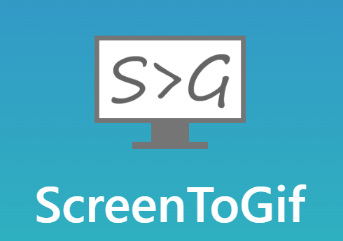

# Projeto com Readme.md

## O Que é um Readme?
Nada menos que um arquivo de leitura.

## O Que é a extensão .md?
A extensão .md significa Markdown.
 Os arquivos MD são arquivos de texto simples que empregam o Linguagem Markdown, que inclui símbolos de texto embutidos que definem como um texto pode ser estruturado, incluindo recuos, formatação de tabela, fontes e cabeçalhos.

## Utilizando Gifs
Descreverei abaixo como colocar um gif (como exemplo, a aula de Readme.md do curso Online do "DevQuest").

Você pode baixar o programa "Screen To Gif", deixarei o link abaixo:



```

```


## Tecnologia utilizada

• HTML

## Como utilizar

1 - Clone para o projeto
```
git clone <url a ser clonada no Github>
```

2 - Acesse a pasta do projeto
```
cd repositorio-com-readme
```

## Markdown Cheatsheet

Se você tiver interesse em saber um pouco mais sobre como customizar seu Readme.md [Clique Aqui](https://github.com/adam-p/markdown-here/wiki/)

Direitos reservados a [Adam Pritchard](https://github.com/adam-p)